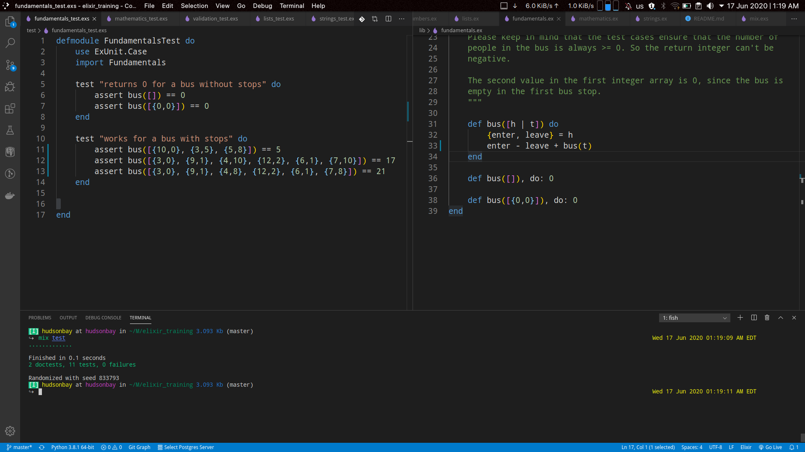

# Elixir Training

## Description



These are a bunch of different algorithms made on Elixir language, broken down by categories.

I made this project because I wanted to learn Elixir by implementing different algorithms. I'm still doing it so forgive me if you find any bad practice(s) here. These algorithms were made by a newbie like me. I still don't know all the libraries.

Notice that there's not an unique solution for a problem so if you want to add a different solution for the same problem feel free to do it.

I also wanted to learn TDD by using ExUnit, so you will find all of the tests that I did. Add your own if you want.

Please, if you wanna contribute to this repository with your own algorithms, situations and use cases you can fork it and do a pull request. Note that I will accept pull request which algorithms has unit tests and are well documented.

You can also feel free to create your own modules. They should also be documented, please.

The aim of the project was also to have a reference or a repository of algorithms for situations and use cases that I can go and check out in case I'd have to do something similar on other projects. I hope it benefits you in the same way than me.

I recommend calling your friend ```iex```. He loves you and will always help you.

Hope you enjoy it.

## Installation

```elixir
mix deps.get
mix test.watch
```

for adding dependencies that I used to generate documentation and test watching.

